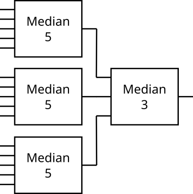

# AxMED
Approximate medians and their formal verifications

This repository shows implementations of approximate medians described in paper submitted to ISCAS conference. The implementations and their parameters can be found in directories
*  [netlist](netlist) netlists for CGP (and for this tool)
*  [vhdl](VHDL) exports of all proposed 

The netlists can also be combined together using _median of medians_ approach using [mom.py](mom.py) script.



```bash
# 9-input median of medians (3x 03-input + 1x 03-input)
python3 mom.py 9 netlist/m03.cha netlist/m03.cha | tail -1 > tmp.cha

# 15-input median of medians (5x 03 + 1x 05)
python3 mom.py 15 netlist/m03.cha netlist/m05.cha | tail -1 > tmp.cha

# Also the approximate implementations can be used from the netlist folder
```


## Formal verification of approximate medians
This tool is able to determine the histogram of errors for arbitrary approximate median having accurate Compare & swap units but somehow pruned. An example of this median is also _median of medians_ shown the abovementioned folders. 

### Basic usage
Firstly, it is imporant to build the BuDDy library (for BDDs) and 
```sh
mkdir build
cd build
cmake ..
make
```

Then you can test the circuit
```
./median-validate ../netlist/s_9_3.cha
```

For details about formal verification, please reffer `PrintFitness` function in [futbessbdd.cxx](src/fitnessbdd.cxx) folder.
